# Introdução

Informações básicas do projeto.

* **Projeto:** Carnalivre
* **Repositório GitHub:** https://github.com/ICEI-PUC-Minas-PMGES-TI/pmg-es-2025-1-ti1-2010200-hermes_sentry.git
* **Membros da equipe:**

1. [Davi Martins de Almeida ](https://github.com/davimartins27)
2. [Henrique Pereira Resende Rocha](https://github.com/Rickyzadas)
3. [João Prado Campos](https://github.com/Joao-Prado0)
4. [Lucas Gabriel de Oliveira Franco](https://github.com/lucasfrgabriel)
5. [Luiz Fernando Cunha Maia](https://github.com/LuizMaia-PUC)
6. [Pedro Henrique Nogueira Ferreira](https://github.com/PedroHNFerreira)

A documentação do projeto é estruturada da seguinte forma:

1. Introdução
2. Contexto
3. Product Discovery
4. Product Design
5. Metodologia
6. Solução
7. Referências Bibliográficas

✅ [Documentação de Design Thinking (MIRO)](files/processo-dt.pdf)

# Contexto

O carnaval é um dos símbolos do nosso país, são cinco dias em que o povo brasileiro se extravaza e faz uma das festas mais bonitas e democráticas do mundo. Marcado pelos blocos de carnaval, música boa e clima quente, a festa atrai milhões de brasileiros para as ruas, além de se tornar uma atração para turistas que pretendem conhecer mais da cultura brasileira. Porém, com o enorme número de pessoas que participam da festa, se torna muito difícil para gestão pública gerenciar a folia, e é nessa dificuldade que nasce a maioria dos problemas relacionados ao feriado.

## Problema

Falando de forma mais local (atenderemos o carnaval da nossa cidade), a cidade de Belo Horizonte tem sido palco de um enorme crescimento na festa de rua com dados da prefeitura de Belo Horizonte mostrando um aumento de 220% no número de blocos cadastrados na prefeitura nos últimos 10 anos. Com esse aumento exponecial da festa, problemas habituais do carnaval como assédio, furtos, roubos, brigas, etc. se tornam mais proeminentes no contexto atual, por uma falta de capacidade do governo de gerir essa nova realidade da cidade. Além de problemas envolvendo a lei, o enorme aumento no fluxo de pessoas, tanto locais quanto turistas, acarreta na super lotação de alguns blocos o que desagrada pessoas que curtiam a festa antigamente. Por fim, esse aumento também torna a busca por blocos que agradam mais confusa, principalmente pela falta de uma plataforma moderna que centralize as informações dos blocos.

## Objetivos

A finalidade do CarnaLivre é desenvolver uma aplicação web que busca ajudar a remediar os problemas no carnaval de Belo Horizonte. Nesse contexto criamos uma plataforma que centraliza todas as informações dos blocos, cadastradas pelos seus próprios organizadores, e apresentaremos elas com imagens, descrição, informações importantes e geolocalização, para facilitar os usuários a escolherem os blocos que mais os agrada. Além disso teremos avaliações de cada bloco para mostrar a opinião pública e ajudar os organizadores a melhorar seus eventos. Além disso, criamos uma aba para denúncia de crimes presenciados pelos cidadões e exibiremos essas informações em um mapa, para assim tentar mostrar aos usuários áreas da cidade que necessessitam mais cautela para aproveitar a festa. 

## Justificativa

A escolha do tema segurança no carnaval surgiu devido todos os participantes do grupo conhecerem alguém que já passou por experiencias ruins no carnaval. O carnaval de Belo Horizonte cada vez mais vem crescendo, recebendo uma grande quantidade de pessoas de várias cidades vizinhas, mas junto a esse grande número de foliões, também temos problemas como furtos, assédios, brigas e muita desinformação. Muita gente não sabe onde estão os blocos, quais são mais tranquilos ou como pedir ajuda em caso de problemas. Pensando nisso, pensamos em um sistema simples e acessível que reúne informações dos blocos, permite comentários dos foliões, e ainda oferece uma aba para denúncias, ajudando a criar um carnaval mais seguro, participativo e consciente para todo mundo.

## Público-Alvo

O CarnaLivre é voltado principalmente para dois públicos: os foliões, que nesse caso são todos os cidadões que aproveitam a festa mais democrática do mundo, sendo assim um público alvo bem abrangente englobando as mais diversas etnias, classes sociais, faixas etárias, etc., esses usuários utilizaram nossa aplicação visando justamente a facilidade no acesso a informações do carnaval; e os organizadores de blocos, que precisam de uma plataforma prática para divulgar seus eventos, atrair mais público e colaborar com a organização e segurança da festa. Ambos se beneficiam da proposta do sistema, já que ele promove uma comunicação mais clara, fortalece a confiança entre participantes e ajuda a tornar o carnaval mais seguro e bem estruturado para todos.

# Product Discovery

## Etapa de Entendimento

* **Matriz CSD**: 
* **Mapa de stakeholders**: 
* **Entrevistas qualitativas**: 

* **Highlights de pesquisa**: 


## Etapa de Definição

### Personas

| Persona 1 | Persona 2 |
| ------- | ------- |
|  |  |

| Persona 3 | Persona 4 |
| --------- | --------- |
|  |  |

| Persona 5 | Persona 6 |
| --------- | --------- |
|  |  |

# Product Design

Nesse momento, vamos transformar os insights e validações obtidos em soluções tangíveis e utilizáveis. Essa fase envolve a definição de uma proposta de valor, detalhando a prioridade de cada ideia e a consequente criação de wireframes, mockups e protótipos de alta fidelidade, que detalham a interface e a experiência do usuário.

## Histórias de Usuários

Com base na análise das personas foram identificadas as seguintes histórias de usuários:

| EU COMO...`PERSONA` | QUERO/PRECISO ...`FUNCIONALIDADE`        | PARA ...`MOTIVO/VALOR`               |
| --------------------- | ------------------------------------------ | -------------------------------------- |
| Usuário: Folião   | Preciso do sistema de denuncias do site | Me sentir mais amparada e protegida em caso de qualquer problemas |
| Usuário: Folião   | Um mapa interativo (API Google Maps) | Não me perder pela cidade enquanto procuro os blocos |
| Usuário: Folião   | Um sistema de pesquisa de blocos | Encontrar informações sobre blocos |
| Usuário: Folião   | Filtros de pesquisa | Para selecionar blocos que atendem aos meus interesses e gostos |
| Usuário: Folião   | Ver o feedback dos blocos  | Para saber qual é o mais animado |
| Usuário: Representante de bloco   | Cadastro dos blocos | Divulgar informações sobre o bloco que organiza, e aumentar seu alcance |
| Usuário: Folião   | Categoria e Feedback dos blocos | Para conseguir curtir em segurança com a minha família |
| Usuário: Folião   | Preciso saber quais lugares/ruas estarao fechados e abertos durante o carnaval | Me organizar durante o periodo da folia|
| Usuário: Folião   | Criar grupos de usuários com meus amigos | Conseguirmos nos encontrar com maior facilidade nos blocos |

## Proposta de Valor

| 1: Vitoria | 2: Juliana |
| ----- | ------ |
|  |  |

| 3: Guilherme | 4: Marcelo |
| ----- | ------ |
|  |  |

| 5: Maria Jeronima | 6: Pedro |
| ----- | ------ |
|  |  |

## Requisitos

As tabelas que se seguem apresentam os requisitos funcionais e não funcionais que detalham o escopo do projeto.

### Requisitos Funcionais


| ID     | Descrição do Requisito                                   | Prioridade |
| ------ | ---------------------------------------------------------- | ---------- |
| RF-001 | O sistema deve ter integração com a API do Google Maps, assim proporcionando mapas interativos e informativos. | ALTA |
| RF-003 | O sistema deve permitir que organizadores cadastrem blocos, informando nome, localização, público esperado, faixa etária média, estilo musical e anexando imagens. | MÉDIA |
| RF-002 | O sistema deve armazenar as infromações cadastradas pelos organizadores do bloco e organizar elas nos mapas. | ALTA |
| RF-004 | O site deve conter cadastro diferente para organizadores de bloco, deve exigir email, senha, CNPJ da organização (para verificação),captcha. | MÉDIA |
| RF-005 | O sistema deve conter cadastramento dos demais usuários, solicitando email, nome completo, senha e nome de usuário. | ALTA |
| RF-006 | O sistema deve conter espaço para login daqueles que já possuem conta (Email e senha). | BAIXA |
| RF-007 | O sistema deve permitir que usuários avaliem os blocos com notas de uma a cinco estrelas, façam comentários sobre os blocos e compartilhem as páginas de eventos. | MÉDIA |
| RF-008 | O sistema deve permitir que usuários registrem denúncias informando local, crime ocorrido, horário e bloco associado. | ALTA |
| RF-009 | O sistema deve permitir que usuários pesquisem os blocos por nome. A pesquisa deve também incluir filtros de pesquisa, sendo eles: tamanho do bloco, região, horário, estilo musical, faixa etária, avaliação e se acontece no dia da pesquisa. | MÉDIA |
| RF-010 | O sistema deve ser capaz de validar o CNPJ informado no cadastro dos organizadores, verificando se é válido segundo as regras da Receita Federal. | BAIXA |

### Requisitos não Funcionais
| ID      | Descrição do Requisito                                                             | Prioridade |
| ------- | ---------------------------------------------------------------------------------- | ---------- |
| RNF-001 | Desenvolvimento em HTML, CSS e JavaScript.(código organizado e eficiente). | MÉDIA |
| RNF-002 | Páginas devem abrir em menos de 5 segundos. | BAIXA |
| RNF-003 | Alta usabilidade, tendo em vista o diverso público alvo que o sistema vai atender. | BAIXA |
| RNF-004 | O site deve ser responsivo para as diferentes telas. | BAIXA |
| RNF-005 | O sistema deve garantir 99,5% de uptime mensal, monitorado por ferramentas de observabilidade. | ALTA |

## Projeto de Interface

Artefatos relacionados com a interface e a interacão do usuário na proposta de solução.

### Wireframes

Estes são os protótipos de telas do sistema.

| Login | Login Bloco |
| ----- | ------ |
|  |  |

| Cadastro Usuario | Cadastro Bloco |
| ----- | ------ |
|  |  |

| Home | Blocos |
| ----- | ------ |
|  |  |

| Descrição dos blocos | Perfil |
| ----- | ------ |
|  |  |

| Selecionar | Home Bloco |
| ----- | ------ |
|  |  |

| Denuncia | Perfil Bloco |
| ----- | ------ |
|  |  |


### Protótipos de Tela

#### HOME-PAGE

Tela inicial do sistema


##### TELA DE LOGIN

Tela para login e/ou cadastro de usuário.


##### TELA DE CADASTRO: Seleção

Tela para realizar cadastro, solicita ao usuário que informe o tipo de cadastro: bloco ou folião.


##### TELA DE CADASTRO: Cadastro

Tela para realizar cadastro de folião ou bloco, solicita ao usuário as informações necessárias para o cadastro.

| Folião | Bloco |
| ----- | ------ |
|  |  |

##### TELA INICIAL

Tela inicial do sistema, mostra ao usuário informações principais:
- Imangens do bloco, para representantes de bloco
- Mapa para foliões

| Folião | Bloco |
| ------ | ----- |
|  |  |

##### TELA DE CONSULTA DE BLOCOS: Folião

Tela de consulta de blocos, permite que o folião veja todos os blocos cadastrados e, ao selecionar um bloco, veja informações detalhadas sobre ele.

| Consulta de blocos | Bloco selecionado |
| ------ | ----- |
|  |  |

##### TELA DE CONSULTA DE BLOCOS: Organizador

Tela de consulta de blocos, permite que o organizador veja as informações cadastradas de seu bloco e altere essas informações.

|  |
| ------ |
|  |

##### TELA DE DENÚNCIAS

Tela de denúncias, permite que o usuário realize uma denúncia.

|  |  |
| ------ | ----- |
|  |  |

##### TELA DE CONVERSAS

Tela de conversas, permite que o usuário se conecte e converse com outros usuários.

| Folião | Bloco |
| ------ | ----- |
|  |  |

##### TELA DE PERFIL

Tela de perfil, permite que o usuário acesse e altere suas configurações do perfil, como foto, nome de usuário, email.

| Folião | Bloco |
| ------ | ----- |
|  |  |

##### TELA DE INFORMAÇÕES DO BLOCO

Tela de informações do bloco, permite que o organizador acesse e altere as configurações do bloco, como fotos, descrição, estilo musical, etc.

| Informações | Imagens |
| ------ | ----- |
|  |  |

### User Flow

**✳️✳️✳️ adicionar user flow atualizado ✳️✳️✳️**

### Protótipo Interativo

**✳️✳️✳️ COLOQUE AQUI UM IFRAME COM SEU PROTÓTIPO INTERATIVO ✳️✳️✳️**

✅ [Protótipo Interativo (MarvelApp)](https://marvelapp.com/prototype/4hd6091?emb=1&iosapp=false&frameless=false)  ⚠️ EXEMPLO ⚠️

> ⚠️ **APAGUE ESSA PARTE ANTES DE ENTREGAR SEU TRABALHO**
>
> Um protótipo interativo apresenta o projeto de interfaces e permite ao usuário navegar pelas funcionalidades como se estivesse lidando com o software pronto. Utilize as mesmas ferramentas de construção de wireframes para montagem do seu protótipo interativo. Inclua o link para o protótipo interativo do projeto.

# Metodologia

API do Google Maps
API de clima

## Ferramentas

| Ambiente                    | Plataforma | Link de acesso                                     |
| --------------------------- | ---------- | -------------------------------------------------- |
| Processo de Design Thinking | Miro       |  https://miro.com/app/board/uXjVIZ5HaSk=/?share_link_id=934339239127 |
| Repositório de código     | GitHub     | https://github.com/ICEI-PUC-Minas-PMGES-TI/pmg-es-2025-1-ti1-2010200-hermes_sentry |
| Protótipo do site         | Figma      | https://www.figma.com/design/lIcNjqnRvlVUjhwUDng2L3/fluxo-de-telas?node-id=0-1&p=f&t=jGkhIGoeICWzf4sn-0 |
| Hospedagem do site          | Render     | https://site.render.com/XXXXXXX ⚠️ EXEMPLO ⚠️ |
| Protótipo Interativo       | MarvelApp  | https://marvelapp.com/XXXXXXX ⚠️ EXEMPLO ⚠️   |
|                             |            |                                                    |

## Gerenciamento do Projeto

Divisão de papéis no grupo e apresentação da estrutura da ferramenta de controle de tarefas (Kanban).


> ⚠️ **APAGUE ESSA PARTE ANTES DE ENTREGAR SEU TRABALHO**
>
> Nesta parte do documento, você deve apresentar  o processo de trabalho baseado nas metodologias ágeis, a divisão de papéis e tarefas, as ferramentas empregadas e como foi realizada a gestão de configuração do projeto via GitHub.
>
> Coloque detalhes sobre o processo de Design Thinking e a implementação do Framework Scrum seguido pelo grupo. O grupo poderá fazer uso de ferramentas on-line para acompanhar o andamento do projeto, a execução das tarefas e o status de desenvolvimento da solução.
>
> **Orientações**:
>
> - [Sobre Projects - GitHub Docs](https://docs.github.com/pt/issues/planning-and-tracking-with-projects/learning-about-projects/about-projects)
> - [Gestão de projetos com GitHub | balta.io](https://balta.io/blog/gestao-de-projetos-com-github)
> - [(460) GitHub Projects - YouTube](https://www.youtube.com/playlist?list=PLiO7XHcmTsldZR93nkTFmmWbCEVF_8F5H)
> - [11 Passos Essenciais para Implantar Scrum no seu Projeto](https://mindmaster.com.br/scrum-11-passos/)
> - [Scrum em 9 minutos](https://www.youtube.com/watch?v=XfvQWnRgxG0)

# Solução Implementada

Esta seção apresenta todos os detalhes da solução criada no projeto.

## Vídeo do Projeto

O vídeo a seguir traz uma apresentação do problema que a equipe está tratando e a proposta de solução. ⚠️ EXEMPLO ⚠️

[](https://www.youtube.com/embed/70gGoFyGeqQ)

> ⚠️ **APAGUE ESSA PARTE ANTES DE ENTREGAR SEU TRABALHO**
>
> O video de apresentação é voltado para que o público externo possa conhecer a solução. O formato é livre, sendo importante que seja apresentado o problema e a solução numa linguagem descomplicada e direta.
>
> Inclua um link para o vídeo do projeto.

## Funcionalidades

Esta seção apresenta as funcionalidades da solução.Info

##### Funcionalidade 1 - Cadastro de Contatos ⚠️ EXEMPLO ⚠️

Permite a inclusão, leitura, alteração e exclusão de contatos para o sistema

* **Estrutura de dados:** [Contatos](#ti_ed_contatos)
* **Instruções de acesso:**
  * Abra o site e efetue o login
  * Acesse o menu principal e escolha a opção Cadastros
  * Em seguida, escolha a opção Contatos
* **Tela da funcionalidade**:

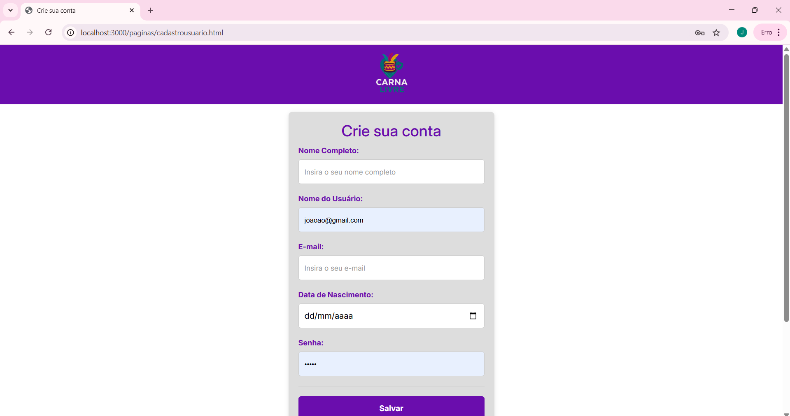

##### Funcionalidade 1 - Cadastro de Contatos ⚠️ EXEMPLO ⚠️

Permite a inclusão, leitura, alteração e exclusão de contatos para o sistema

* **Estrutura de dados:** [Contatos](#ti_ed_contatos)
* **Instruções de acesso:**
  * Abra o site e efetue o login
  * Acesse o menu principal e escolha a opção Cadastros
  * Em seguida, escolha a opção Contatos
* **Tela da funcionalidade**:

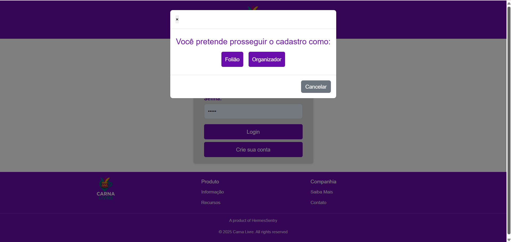

##### Funcionalidade 1 - Cadastro de Contatos ⚠️ EXEMPLO ⚠️

Permite a inclusão, leitura, alteração e exclusão de contatos para o sistema

* **Estrutura de dados:** [Contatos](#ti_ed_contatos)
* **Instruções de acesso:**
  * Abra o site e efetue o login
  * Acesse o menu principal e escolha a opção Cadastros
  * Em seguida, escolha a opção Contatos
* **Tela da funcionalidade**:

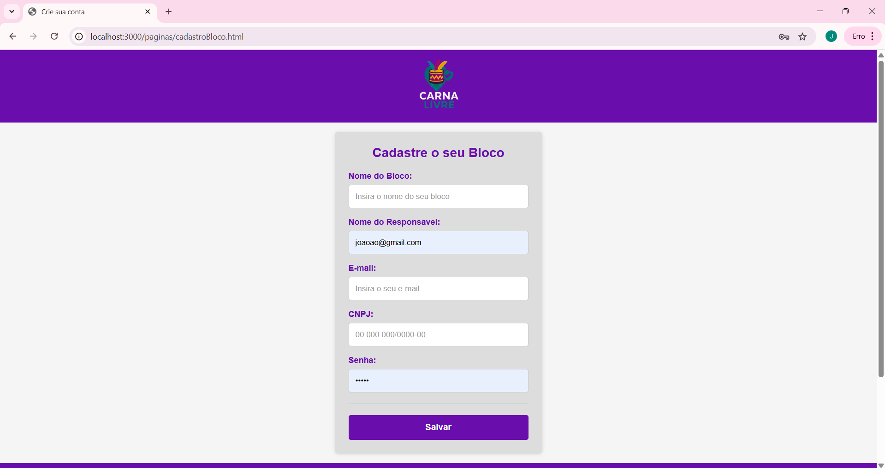

##### Funcionalidade 1 - Cadastro de Contatos ⚠️ EXEMPLO ⚠️

Permite a inclusão, leitura, alteração e exclusão de contatos para o sistema

* **Estrutura de dados:** [Contatos](#ti_ed_contatos)
* **Instruções de acesso:**
  * Abra o site e efetue o login
  * Acesse o menu principal e escolha a opção Cadastros
  * Em seguida, escolha a opção Contatos
* **Tela da funcionalidade**:

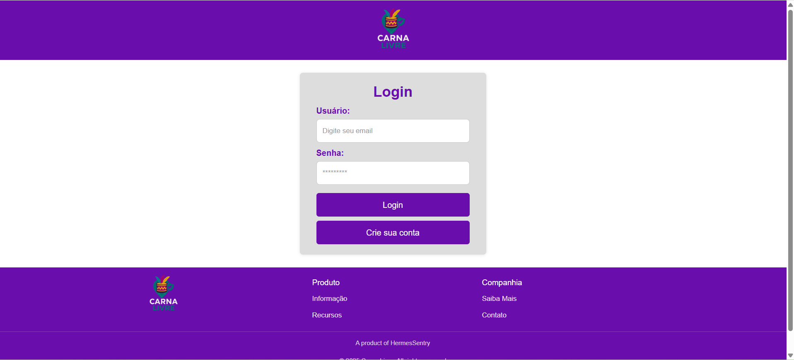

##### Funcionalidade 1 - Cadastro de Contatos ⚠️ EXEMPLO ⚠️

Permite a inclusão, leitura, alteração e exclusão de contatos para o sistema

* **Estrutura de dados:** [Contatos](#ti_ed_contatos)
* **Instruções de acesso:**
  * Abra o site e efetue o login
  * Acesse o menu principal e escolha a opção Cadastros
  * Em seguida, escolha a opção Contatos
* **Tela da funcionalidade**:

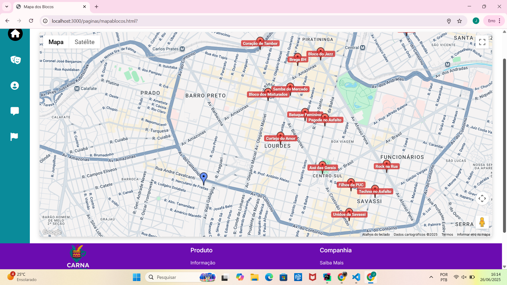

##### Funcionalidade 1 - Cadastro de Contatos ⚠️ EXEMPLO ⚠️

Permite a inclusão, leitura, alteração e exclusão de contatos para o sistema

* **Estrutura de dados:** [Contatos](#ti_ed_contatos)
* **Instruções de acesso:**
  * Abra o site e efetue o login
  * Acesse o menu principal e escolha a opção Cadastros
  * Em seguida, escolha a opção Contatos
* **Tela da funcionalidade**:

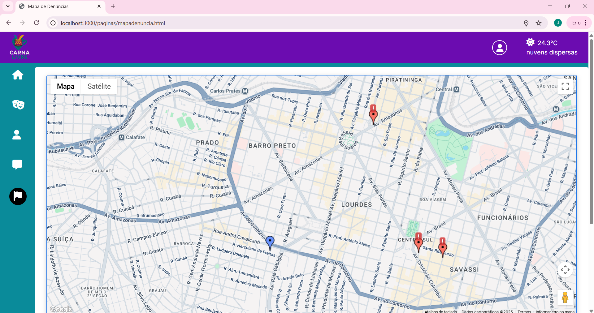

##### Funcionalidade 1 - Cadastro de Contatos ⚠️ EXEMPLO ⚠️

Permite a inclusão, leitura, alteração e exclusão de contatos para o sistema

* **Estrutura de dados:** [Contatos](#ti_ed_contatos)
* **Instruções de acesso:**
  * Abra o site e efetue o login
  * Acesse o menu principal e escolha a opção Cadastros
  * Em seguida, escolha a opção Contatos
* **Tela da funcionalidade**:

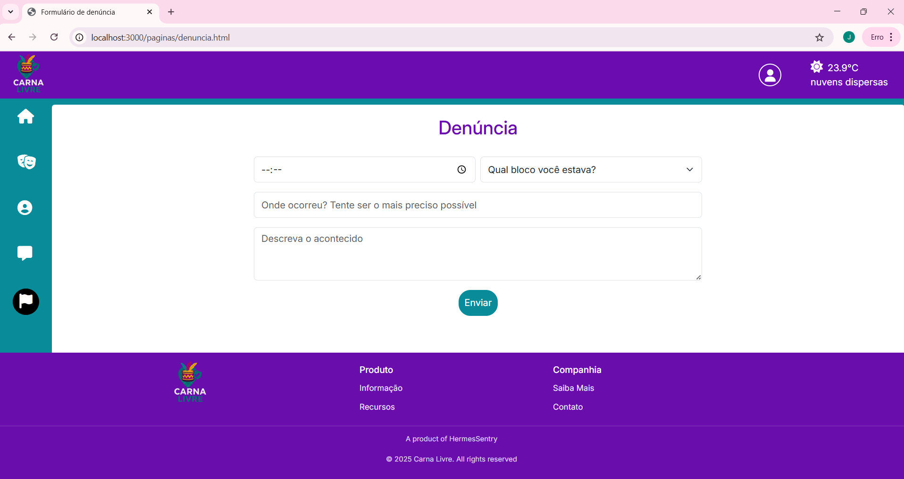

##### Funcionalidade 1 - Cadastro de Contatos ⚠️ EXEMPLO ⚠️

Permite a inclusão, leitura, alteração e exclusão de contatos para o sistema

* **Estrutura de dados:** [Contatos](#ti_ed_contatos)
* **Instruções de acesso:**
  * Abra o site e efetue o login
  * Acesse o menu principal e escolha a opção Cadastros
  * Em seguida, escolha a opção Contatos
* **Tela da funcionalidade**:


##### Funcionalidade 1 - Cadastro de Contatos ⚠️ EXEMPLO ⚠️

Permite a inclusão, leitura, alteração e exclusão de contatos para o sistema

* **Estrutura de dados:** [Contatos](#ti_ed_contatos)
* **Instruções de acesso:**
  * Abra o site e efetue o login
  * Acesse o menu principal e escolha a opção Cadastros
  * Em seguida, escolha a opção Contatos
* **Tela da funcionalidade**:

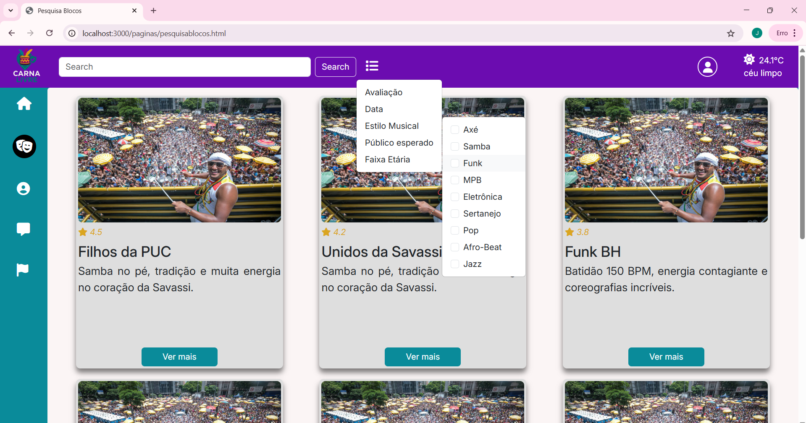

##### Funcionalidade 1 - Cadastro de Contatos ⚠️ EXEMPLO ⚠️

Permite a inclusão, leitura, alteração e exclusão de contatos para o sistema

* **Estrutura de dados:** [Contatos](#ti_ed_contatos)
* **Instruções de acesso:**
  * Abra o site e efetue o login
  * Acesse o menu principal e escolha a opção Cadastros
  * Em seguida, escolha a opção Contatos
* **Tela da funcionalidade**:

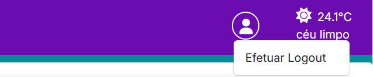

##### Funcionalidade 1 - Cadastro de Contatos ⚠️ EXEMPLO ⚠️

Permite a inclusão, leitura, alteração e exclusão de contatos para o sistema

* **Estrutura de dados:** [Contatos](#ti_ed_contatos)
* **Instruções de acesso:**
  * Abra o site e efetue o login
  * Acesse o menu principal e escolha a opção Cadastros
  * Em seguida, escolha a opção Contatos
* **Tela da funcionalidade**:

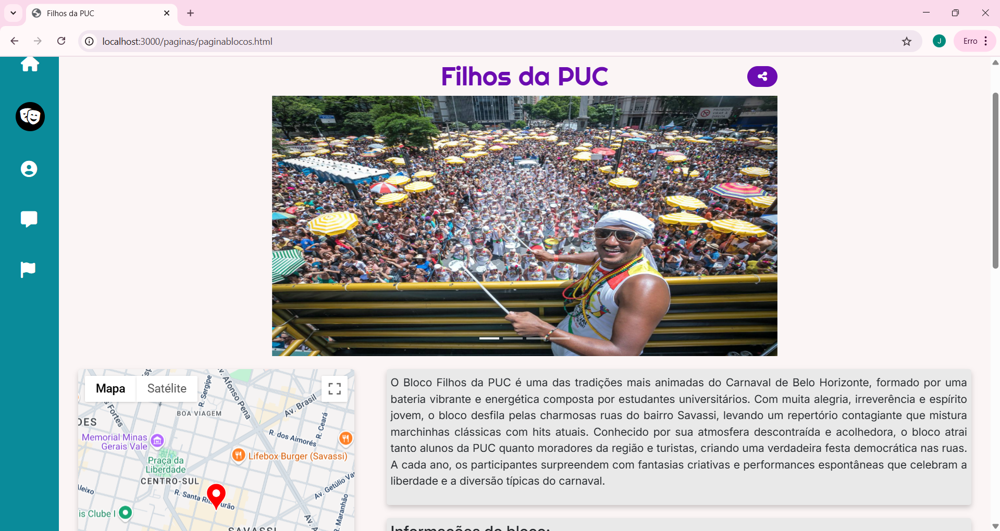

##### Funcionalidade 1 - Cadastro de Contatos ⚠️ EXEMPLO ⚠️

Permite a inclusão, leitura, alteração e exclusão de contatos para o sistema

* **Estrutura de dados:** [Contatos](#ti_ed_contatos)
* **Instruções de acesso:**
  * Abra o site e efetue o login
  * Acesse o menu principal e escolha a opção Cadastros
  * Em seguida, escolha a opção Contatos
* **Tela da funcionalidade**:

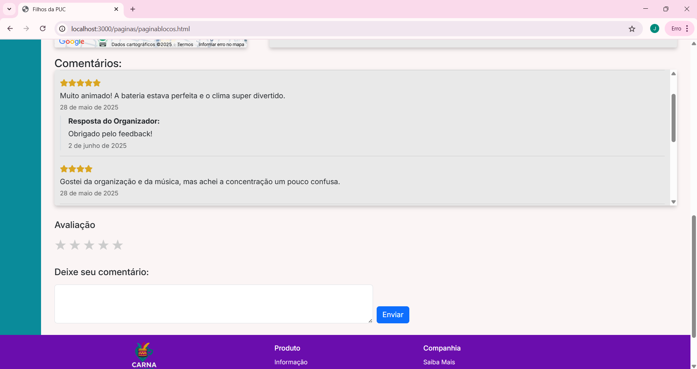

##### Funcionalidade 1 - Cadastro de Contatos ⚠️ EXEMPLO ⚠️

Permite a inclusão, leitura, alteração e exclusão de contatos para o sistema

* **Estrutura de dados:** [Contatos](#ti_ed_contatos)
* **Instruções de acesso:**
  * Abra o site e efetue o login
  * Acesse o menu principal e escolha a opção Cadastros
  * Em seguida, escolha a opção Contatos
* **Tela da funcionalidade**:

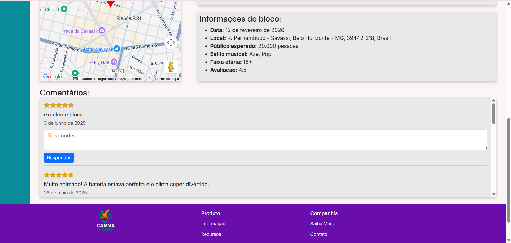

##### Funcionalidade 1 - Cadastro de Contatos ⚠️ EXEMPLO ⚠️

Permite a inclusão, leitura, alteração e exclusão de contatos para o sistema

* **Estrutura de dados:** [Contatos](#ti_ed_contatos)
* **Instruções de acesso:**
  * Abra o site e efetue o login
  * Acesse o menu principal e escolha a opção Cadastros
  * Em seguida, escolha a opção Contatos
* **Tela da funcionalidade**:

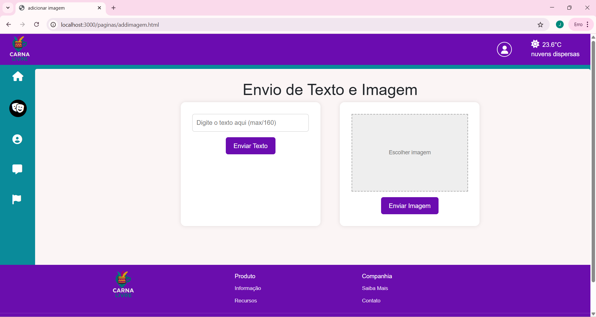

##### Funcionalidade 1 - Cadastro de Contatos ⚠️ EXEMPLO ⚠️

Permite a inclusão, leitura, alteração e exclusão de contatos para o sistema

* **Estrutura de dados:** [Contatos](#ti_ed_contatos)
* **Instruções de acesso:**
  * Abra o site e efetue o login
  * Acesse o menu principal e escolha a opção Cadastros
  * Em seguida, escolha a opção Contatos
* **Tela da funcionalidade**:

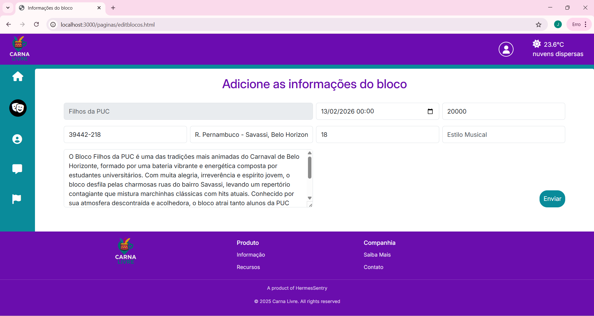

##### Funcionalidade 1 - Cadastro de Contatos ⚠️ EXEMPLO ⚠️

Permite a inclusão, leitura, alteração e exclusão de contatos para o sistema

* **Estrutura de dados:** [Contatos](#ti_ed_contatos)
* **Instruções de acesso:**
  * Abra o site e efetue o login
  * Acesse o menu principal e escolha a opção Cadastros
  * Em seguida, escolha a opção Contatos
* **Tela da funcionalidade**:

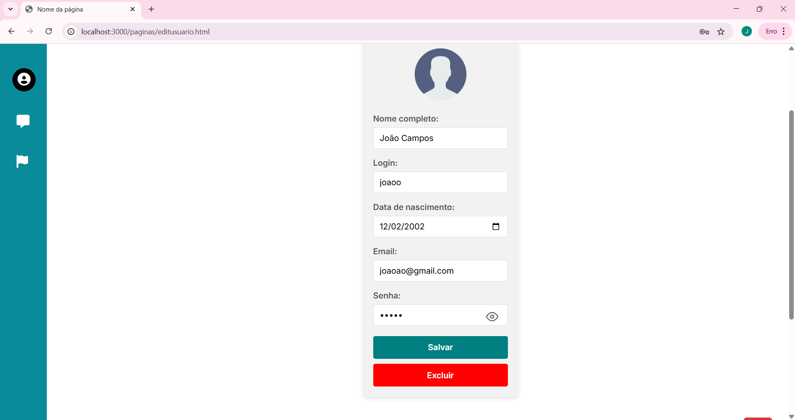

##### Funcionalidade 1 - Cadastro de Contatos ⚠️ EXEMPLO ⚠️

Permite a inclusão, leitura, alteração e exclusão de contatos para o sistema

* **Estrutura de dados:** [Contatos](#ti_ed_contatos)
* **Instruções de acesso:**
  * Abra o site e efetue o login
  * Acesse o menu principal e escolha a opção Cadastros
  * Em seguida, escolha a opção Contatos
* **Tela da funcionalidade**:


> ⚠️ **APAGUE ESSA PARTE ANTES DE ENTREGAR SEU TRABALHO**
>
> Apresente cada uma das funcionalidades que a aplicação fornece tanto para os usuários quanto aos administradores da solução.
>
> Inclua, para cada funcionalidade, itens como: (1) titulos e descrição da funcionalidade; (2) Estrutura de dados associada; (3) o detalhe sobre as instruções de acesso e uso.

## Estruturas de Dados

Todas as estruturas descritas estão juntas no mesmo arquivo db.json. Estão funcionando como API Restful por meio do JSON-Server

##### Estrutura de Dados - Blocos de Carnaval   

Cadastro de blocos de carnaval, com um único organizador atrelado a cada bloco, além de um objeto para imagens e descrição para cards.

```json
  {
      "id": 1,
      "nome_bloco": "Filhos da PUC",
      "descricao_geral": "O Bloco Filhos da PUC é composto por uma bateria vibrante formada por estudantes universitários. Com muita alegria e irreverência, o bloco desfila pelas ruas da Savassi. fwokenfoiw  kjweg nfoiwengoiwq fiownqifnwo3ir rw3jfnwiqnfqoin3qkw fokweno",
      "avaliacao": 4.5,
      "data": "2026-02-13",
      "publico": 20000,
      "cep": "39442-218",
      "endereco": "R. Pernambuco - Savassi, Belo Horizonte - MG, 39442-218, Brasil",
      "faixa_etaria": "18+",
      "lat": -19.9350252,
      "lng": -43.9346582,
      "estilo_musical": "Axé, Pop",
      "organizador": [
        {
          "nome_org": "João P. Andrade",
          "email_org": "joao@filhosdapuc.com",
          "cnpj": "12.345.678/0001-00",
          "senha": "senha123"
        }
      ],
      "postagem": [
        {
          "descricao_card": "Samba no pé, tradição e muita energia no coração da Savassi.",
          "imagens": [
            {
              "id": 1,
              "src": "../assets/img/blocoexemplo.jpg"
            },
            {
              "id": 2,
              "src": "../assets/img/blocoexemplo.jpg"
            },
            {
              "id": 3,
              "src": "../assets/img/blocoexemplo.jpg"
            },
            {
              "id": 4,
              "src": "../assets/img/blocoexemplo.jpg"
            }
          ]
        }
      ]
    },
  
```

##### Estrutura de Dados - Usuários Foliões

Registro dos usuários do sistema utilizados para login e para o perfil do sistema.

```json
  {
      "id": 2,
      "nome_completo": "João Campos",
      "login": "joaoo",
      "email": "joaoao@gmail.com",
      "data_nasc": "2002-02-12",
      "senha": "12345",
      "chat": {
        "contacts": [],
        "groups": [],
        "messages": {}
      }
 },
```

##### Estrutura de Dados - Denúncias

Cadastro de denúncias com descrição e localização para exibição em mapa interativo.

```json
  {
      "id": 1,
      "horario": "16:30",
      "bloco": "Filhos da PUC",
      "local": "R. Pernambuco - Savassi, Belo Horizonte - MG, 39442-218, Brasil",
      "lat": -19.9350252,
      "lng": -43.9346582,
      "ocorrido": "assalto"
    },
```

##### Estrutura de Dados - Comentários

Cadastro de comentários atrelados a cada página de blocos, com objeto para armazenar a resposta do organizador bloco.

```json
  {
      "id": 1,
      "blocoId": 1,
      "usuarioId": 1,
      "texto": "Muito animado! A bateria estava perfeita e o clima super divertido.",
      "avaliacao": 5,
      "data": "2025-05-28T15:30:00",
      "resposta": {
        "texto": "Obrigado pelo feedback!",
        "data": "2025-06-02T21:40:56.072Z",
        "organizadorId": "99"
      }
 },
```

## Módulos e APIs

Esta seção apresenta os módulos e APIs utilizados na solução

**Estrutura de Dados**:

* NPM/JSON-Server - [https://www.npmjs.com/package/json-server](https://www.npmjs.com/package/json-server)

**Mapa**:

* Google Maps/Place API - [https://developers.google.com/maps/apis-by-platform?hl=pt-br](https://developers.google.com/maps/apis-by-platform?hl=pt-br)

**Clima**:

* Open Weather - [https://openweathermap.org/api](https://openweathermap.org/api)

**Fonts:**

* Icons Font Face - [https://fontawesome.com/](https://fontawesome.com/)
* Google Fonts - [https://fonts.google.com/](https://fonts.google.com/)

**Scripts:**

* jQuery - [http://www.jquery.com/](http://www.jquery.com/) 
* Bootstrap 4 - [http://getbootstrap.com/](http://getbootstrap.com/) 

# Referências

As referências utilizadas no trabalho foram:

* SOBRENOME, Nome do autor. Título da obra. 8. ed. Cidade: Editora, 2000. 287 p ⚠️ EXEMPLO ⚠️

> ⚠️ **APAGUE ESSA PARTE ANTES DE ENTREGAR SEU TRABALHO**
>
> Inclua todas as referências (livros, artigos, sites, etc) utilizados no desenvolvimento do trabalho.
>
> **Orientações**:
>https://www.cnnbrasil.com.br/nacional/sudeste/mg/carnaval-em-bh-numero-de-blocos-cadastrados-cresce-3116-em-10-anos/
> - [Formato ABNT](https://www.normastecnicas.com/abnt/trabalhos-academicos/referencias/)
> - [Referências Bibliográficas da ABNT](https://comunidade.rockcontent.com/referencia-bibliografica-abnt/)
